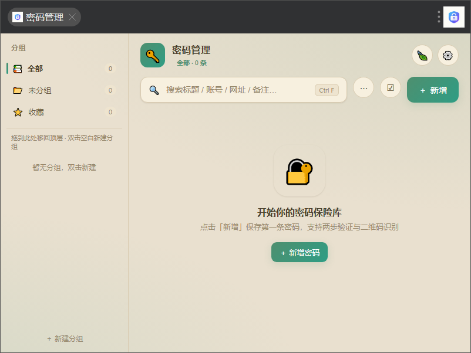
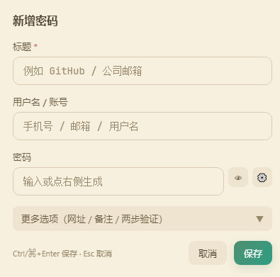
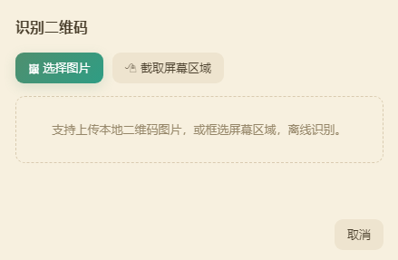

# 🔑 我的密码（uTools 插件）

> 由 AI 开发的本地密码保险库。基于 **Vue 3 + Vite**，面向 uTools 插件分发。
>
> AES-256 加密 · 分组拖拽 · TOTP 动态码 · 离线扫码 · 批量管理

一款安全、简洁、离线可用的密码管理器：默认开箱即用，可选主密码加密；支持多级分组拖拽、收藏置顶、强随机密码生成、TOTP 动态码与离线二维码识别，并提供浏览器/WiFi 密码导入能力。在 uTools 搜索框搜索「**我的密码**」即可打开。

## ✨ 功能亮点

- **加密存储**：默认明文；开启主密码后以 **AES-256-GCM**（PBKDF2-SHA256，10 万次迭代）加密落盘，退出自动锁定
- **多级分组**：分组侧栏树形层级，支持新建 / 重命名 / 删除
- **拖拽操作**：账号列表内拖动排序；拖到分组变更所属分组；分组节点拖拽改层级（before / after / inside）
- **收藏置顶**：点星标收藏并置顶显示
- **搜索**：标题 / 账号 / 网址 / 备注模糊过滤，`Ctrl/⌘+F` 聚焦
- **强随机密码生成器**：长度、字符集、剔除易混淆字符可配（`Crypto.getRandomValues`）
- **TOTP 两步验证**：绑定 Base32 或 `otpauth://`，实时生成 6 位动态码（倒计时 + 一键复制）
- **离线二维码识别**：上传图片或框选屏幕区域识别，自动回填密钥/账号/标题（内置 jsQR，按需加载）
- **一键复制**：账号 / 密码 / 动态码，15 秒后自动清空剪贴板；卡片「📤」打开分享弹窗，可复制文字或生成**二维码**分享
- **接收分享密码**：粘贴分享文字 / 选择二维码图片 / 读取剪贴板，自动解析账号、密码、网址、备注、TOTP、WiFi 直连信息（中英文标签兼容），核对编辑后一键入库
- **WiFi 直连二维码**：手动填写或扫码回填生成 `WIFI:` 直连二维码（支持 WPA/WEP/无密码与隐藏网络），手机扫码直接连网；可保存图片或存入密码库
- **批量管理**：勾选 / 全选 / 反选，批量删除、复制、移动到分组
- **导入**：统一「密码文件」入口，JSON 备份与 Chrome / Edge 导出的 CSV 自动识别；Windows / macOS / Linux 本机 WiFi 密码读取与导入
- **分组导出**：按当前分组（含子分组）/ 全部 / 未分组 / 收藏范围导出 JSON 备份；也可导出为 **Chrome / Edge 可直接导入的 CSV**（当前分组或全部，含备注列）
- **空闲自动锁定**：主密码空闲超时（时长可配，关闭/1/5/15/30/60 分钟）自动锁定；宽限期内重进插件免输主密码
- **密码生成器“锁定”**：生成后一键锁定，防止重新生成误覆盖
- **WebDAV 云备份**：可开关，把密码库备份到 WebDAV（坚果云 / Nextcloud / 群晖等），支持测试连接、立即备份、云端恢复
- **三套主题**：亮色 / 暗色 / 护眼（可记忆）
- **数据同步（可关）**：开启走 uTools `dbStorage`（会员同步）；关闭仅存本机，符合离线安全要求

## 🖼 截图

| 主界面 | 新增 / 编辑密码 | 离线二维码识别 |
| :-: | :-: | :-: |
|  |  |  |

## 🧱 技术栈

- **Vue 3 + Vite**（`@vitejs/plugin-vue`）
- **jsQR**（离线二维码解码，动态 import 按需加载）
- 内置等宽字体 **JetBrains Mono**（`l/I/0/O` 区分清晰）
- Node 侧（preload）能力：AES-256-GCM 加解密、文件读写、TOTP 生成、`netsh`/`networksetup`/`nmcli`（跨平台 WiFi 读取）

## 📁 目录结构

```
public/            # 打包时原样拷贝到 dist
  plugin.json      # uTools 插件配置
  preload/         # 预加载脚本（加密、文件读写、WiFi 读取）
  logo.png
src/
  store/vault.js   # 数据层：持久化 / 解锁 / CRUD / 分组 & 拖拽
  store/dnd.js     # 拖拽共享上下文
  store/member.js  # uTools 会员/数据同步状态
  store/theme.js   # 三套主题
  utils/           # 密码生成器、Toast、二维码、浏览器 CSV、剪贴板、分享文字解析、WiFi payload
  components/      # LockScreen/EntryForm/Generator/Settings/QrScanner/QrScanButtons/TotpCode/GroupNode/GroupPicker/ShareDialog/ReceiveShare/WifiQr/WifiImport/ImportDestination/ConfirmDialog
  views/VaultView.vue
  App.vue
  main.css
```

## 🚀 开发

```bash
npm install
npm run dev        # http://127.0.0.1:5173（需保持运行）
```

在 uTools「设置 → 开发者工具 → 插件开发工具」选择本目录（含 `plugin.json`），`development.main` 已指向 `http://127.0.0.1:5173`。

> 注意：开发模式须保持 `npm run dev` 运行；直接用非开发方式加载文件夹会走生产 `index.html`，需先 `npm run build` 并加载 `dist/`。

## 📦 打包 / 安装

```bash
npm run build      # 输出到 dist/
```

`dist/` 已含 `index.html`、`plugin.json`、`preload/`、`logo.png`，可用插件开发工具加载，或压缩为 `.upx` 用 uTools 安装。

## 🔐 隐私与安全

- 开启主密码后，条目以 AES-256-GCM 认证加密保存在本地，数据库内无明文、无密钥；
- 关闭数据同步后，数据仅写入本机文件（`userData/password_vault_local.json`），不随 uTools 上传；
- 密钥仅由主密码派生，忘记主密码将无法解密（界面已明确提示）；
- WebDAV 云备份：开启主密码时备份为加密 blob；未开启则为明文（界面有提示）。宽限期自动解锁的派生密钥仅短暂存于本机并随锁定删除。

## 🗒 更新日志

- **v0.0.6**：
  - 新增「接收分享密码」：粘贴分享文字 / 选择二维码图片 / 读取剪贴板三种来源，自动解析账号、密码、网址、备注、TOTP、WiFi 直连信息（中英文标签兼容），核对编辑后一键入库；
  - 新增「生成 WiFi 二维码」：生成 `WIFI:` 直连二维码（WPA/WEP/无密码、隐藏网络），支持扫码回填、保存图片、一键存入密码库；手机扫码可直接连网；
  - 新增剪贴板读取能力：剪贴板文字直接读取，剪贴板图片自动 jsQR 解码；
  - 组件与工具统一：分组选择收敛为 `GroupPicker`（5 处复用，支持内联新建分组）、扫码按钮收敛为 `QrScanButtons`、9 处复制触点收敛为 `clipboard.js`（15 秒自动清除、复制图片不被误清、浏览器环境失败不再误报）；
  - 「更多」菜单整理为「导入 / 导出 / 工具」二级子菜单；「导入」与「导入浏览器密码」合并为「密码文件」，JSON 备份与浏览器 CSV 自动识别；
  - 修复：读取本机 WiFi 导入时已选分组被静默忽略、弹窗内新建分组后取消会残留空分组、WiFi 导入按钮死状态等问题。
- **v0.0.5**：导入统一“导入目标”（普通 JSON / 浏览器 CSV / WiFi 可选 按文件分组-合并 / 当前分组 / 全部 / 指定分组+新建，修复“按文件分组”覆盖现有数据）；新增分组批量管理（全选/反选、批量移动、批量删除）；WiFi 分享升级（复制文字 / 手机扫码直连二维码）；设置“关于”新增 GitHub 建议/反馈入口（隐藏链接）。
- **v0.0.4**：分享升级为弹窗——可复制文字或生成**二维码**（扫码查看，含保存/复制图片）。
- **v0.0.3**：新增一键分享复制；空闲自动锁定（时长可配 + 宽限期重进免输主密码）；密码生成器“锁定”防误覆盖；WebDAV 云备份（可开关、测试连接 / 备份 / 恢复）。
- **v0.0.2**：新增分组导出（按分组/子分组/全部/未分组/收藏范围导出 JSON）。
- **v0.0.1**：首个版本（密码增删改查与搜索、分组拖拽、收藏置顶、密码生成、TOTP、离线扫码、批量管理、浏览器/WiFi 导入、主密码加密与自动锁定、三主题、导入导出）。

## 📄 许可

[AGPL-3.0](LICENSE)（GNU Affero General Public License v3.0）

---

<p align="center">由 AI 开发 · 个人项目</p>
